

<a href="https://Microck.pythonanywhere.com/link">
  <picture>
    <source
      media="(prefers-color-scheme: light), (prefers-color-scheme: no-preference)"
      srcset="https://Microck.pythonanywhere.com?theme=light&eq_color=B19AEF&spin=true"
    />
    <source
      media="(prefers-color-scheme: dark)"
      srcset="https://Microck.pythonanywhere.com?theme=dark&eq_color=B19AEF&spin=true"
    />
    
  </picture>
</a>

<!-- Projects collage (auto-wraps based on screen width) -->

  <!-- Thumbs live in this repo under assets/thumbgs2/ -->
  
  <a href="https://github.com/Microck/ascii.micr">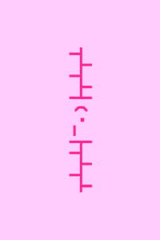</a>
  <a href="https://github.com/Microck/Celeste-QuarziteSkin">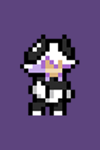</a>
  <a href="https://github.com/Microck/chalcopyrite">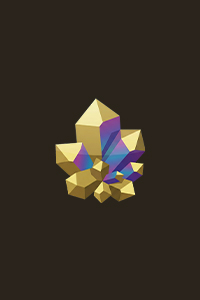</a>
  
  <a href="https://github.com/Microck/cinco">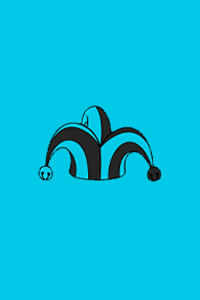</a>
  <a href="https://github.com/Microck/DialogueTextbox-Generator">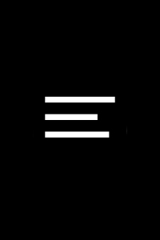</a>
  
  <a href="https://github.com/Microck/glob">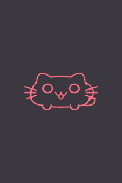</a>
  
  
  
  
  <a href="https://github.com/Microck/opencode-studio">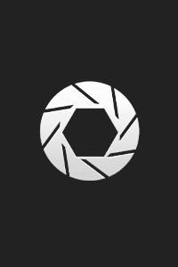</a>
  
  
  <a href="https://github.com/Microck/sincronizado">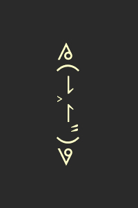</a>
  <a href="https://github.com/Microck/tuneport">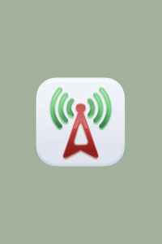</a>
  
  
  <a href="https://github.com/Microck/vapora">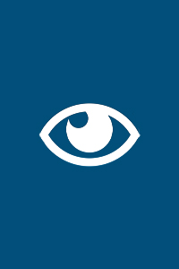</a>
  <a href="https://github.com/Microck/waterWAV">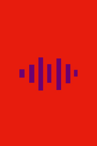</a>
  <a href="https://github.com/Microck/YAWN60">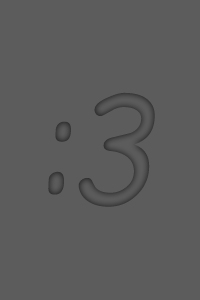</a>

